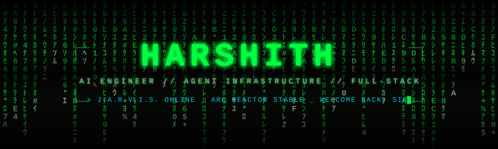

<!--
  ╔══════════════════════════════════════════════════════════════╗
  ║  REMAINING TODO before you push:                             ║
  ║   1. Repo MUST be named exactly  Harshith029  for this       ║
  ║      to appear on your profile page.                         ║
  ║   2. Run the "Generate Snake Animation" workflow once        ║
  ║      (Actions tab -> Run workflow) to create the snake.      ║
  ║  Everything else — username, projects, socials — is live.    ║
  ╚══════════════════════════════════════════════════════════════╝
-->

<div align="center">



<a href="https://github.com/Harshith029">
  
</a>

<br/>


</div>

##  `SYSTEM PROFILE`

<table>
<tr>
<td width="58%" valign="top">

```bash
harshith@stark-industries:~$ whoami --verbose
```

```yaml
identity:
  name:    "Harshith"
  role:    "AI Engineer / Full-Stack Developer"
  status:  "Suit up. Ship code. Repeat."

currently:
  building:  "Guardrails and tooling for AI agents"
  shipping:  "safemigrate-lint — live on PyPI"
  exploring: "Agent security, entity resolution,
              and reliability telemetry"
  learning:  "Distributed systems & system design"

protocols:
  ask_me_about: [ "Python", "LLM tooling", "Postgres",
                  "Agent infrastructure" ]
  open_to:      [ "Internships", "Open Source", "Collabs" ]
  reach_me_at:  "harshith.pali3286@gmail.com"

fun_fact: "I don't have a suit — I have a keyboard.
           Same energy, better uptime."
```

</td>
<td width="42%" valign="top" align="center">



**`ARC REACTOR :: STABLE`**<br/>
<sub>`POWER OUTPUT ......... 100%`</sub><br/>
<sub>`CAFFEINE LEVELS ...... 98%`</sub><br/>
<sub>`BUGS REMAINING ....... ∞`</sub>

</td>
</tr>
</table>

<div align="center"></div>

##  `THE ARMORY // TECH STACK`

<div align="center">

`> loading suit configurations...`

**Languages**


**Frontend & Frameworks**


**Backend & Data**


**AI / ML**


<br/>


**Tools & Deployment**


<br/>


</div>

<div align="center"></div>

##  `SYSTEM DIAGNOSTICS`

<div align="center">


</div>

<div align="center"></div>

##  `MISSION LOG // PROJECTS`

<div align="center">

| `#` | `MISSION` | `TECH DEPLOYED` | `STATUS` |
|:---:|:---|:---|:---:|
| `01` | **[safemigrate-lint](https://github.com/Harshith029/safemigrate-lint)** — lints Postgres migrations for operations that break production | `Python` `Static Analysis` | 🟢 [`ON PYPI`](https://pypi.org/project/safemigrate-lint/) |
| `02` | **[Sentinel](https://github.com/Harshith029/Sentinel)** — provenance-aware security proxy for AI agents | `Python` `AI Security` | 🟢 [`LIVE DEMO`](https://sentinel-i63x.onrender.com) |
| `03` | **[faultline](https://github.com/Harshith029/faultline)** — self-hosted agent ranking services by multi-signal telemetry drift | `JavaScript` `Observability` | 🟢 [`WRITE-UP`](https://builder.aws.com/content/3AuBMFpv22Kue07Q8ZxD0n1GJGD/aideas-faultline-ai-assisted-predictive-reliability-intelligence-for-distributed-systems) |
| `04` | **[KARMA](https://github.com/Harshith029/KARMA)** — probabilistic entity resolution for government databases | `Python` `Record Linkage` | 🟡 `ACTIVE` |
| `05` | **[prompt-debugger](https://github.com/Harshith029/prompt-debugger)** — local-first toolkit for when legitimate prompts trip safeguards | `Python` `LLM Tooling` | 🟡 `ACTIVE` |
| `06` | **[Portfolio-v2](https://github.com/Harshith029/Portfolio-v2)** — AI engineer & full-stack developer portfolio | `HTML` `JavaScript` | 🟢 [`LIVE`](https://harshith029.github.io/Portfolio-v2/) |

</div>

<details>
<summary><b><code>&gt; decrypt --archive  // more experiments</code></b></summary>

<br/>

| `MISSION` | `WHAT IT DOES` | `STACK` |
|:---|:---|:---|
| **[india-runs-track1](https://github.com/Harshith029/india-runs-track1)** | Deterministic candidate discovery and ranking — [live on Streamlit](https://india-runs-track1-aaqd86g8ktcxvgtvvdevop.streamlit.app/) | `Python` `Streamlit` |
| **[nemotron-reasoning-solvers](https://github.com/Harshith029/nemotron-reasoning-solvers)** | Offline pipeline for the NVIDIA Nemotron Reasoning Challenge | `Python` `LLM` |
| **[safemigrate](https://github.com/Harshith029/safemigrate)** | Safety-critical database migration environment for AI agents | `Python` |
| **[UGV-Pathfinding-AI](https://github.com/Harshith029/UGV-Pathfinding-AI)** | Dijkstra + A\* for autonomous vehicle navigation | `Python` `Algorithms` |
| **[CSP](https://github.com/Harshith029/CSP)** | Classic Constraint Satisfaction Problem solvers | `Python` `AI` |
| **[uninformed-search](https://github.com/Harshith029/uninformed-search)** | Modular BFS / DFS / UCS search implementations | `Python` `AI` |
| **[aqi-reflex-agent](https://github.com/Harshith029/aqi-reflex-agent)** | Reflex agent computing Air Quality Index from sensor data | `Python` `AI` |
| **[paging-adventure](https://github.com/Harshith029/paging-adventure)** | Gamified OS memory-management simulator | `JavaScript` `OS` |
| **[Chess-game](https://github.com/Harshith029/Chess-game)** | 2D chess built on HTML5 Canvas | `JavaScript` `Canvas` |

</details>

<div align="center"></div>

##  `INTRUSION TRACE`

<div align="center">


<sub>`the snake eats my commits — powered by GitHub Actions`</sub>

</div>

<div align="center"></div>

##  `ESTABLISH UPLINK`

<div align="center">

`> opening secure channel...`  `> encryption: enabled`  `> latency: ~24h`

<br/>

<a href="https://www.linkedin.com/in/krishnaharshith/"></a>
<a href="mailto:harshith.pali3286@gmail.com"></a>
<a href="https://x.com/HPali3286"></a>
<a href="https://github.com/Harshith029"></a>
<a href="https://harshith029.github.io/Portfolio-v2/"></a>
<!-- LeetCode: add your real handle and uncomment
<a href="https://leetcode.com/u/YOUR_HANDLE"></a>
-->

<br/>

<table align="center">
<tr>
<td align="center" width="33%">

`⚡ HIRING`

<sub>Internships & full-time<br/>AI / backend / platform</sub>

</td>
<td align="center" width="34%">

`🛠 COLLAB`

<sub>Open source, agent tooling,<br/>dev-infra experiments</sub>

</td>
<td align="center" width="33%">

`💬 JUST TALK`

<sub>LLM guardrails, Postgres,<br/>or why your migration broke</sub>

</td>
</tr>
</table>

</div>

<div align="center"></div>

##  `POWER THE REACTOR`

<div align="center">

<sub>`palladium core running low — refuels accepted in caffeine`</sub>

<br/><br/>

<a href="https://github.com/sponsors/Harshith029"></a>
<!-- Sign up at buymeacoffee.com / ko-fi.com with these handles, then uncomment:
<a href="https://www.buymeacoffee.com/harshith029"></a>
<a href="https://ko-fi.com/harshith029"></a>
-->

<br/><br/>

<sub>`or just ⭐ a repo — costs nothing, powers everything`</sub>

</div>

<div align="center"></div>

##  `FIELD COMMENDATIONS`

<div align="center">

<table>
  <tr>
    <td align="center">
      <a href="https://cloud.layer5.io/user/6989cfad-e0f4-437f-8071-0133e1f70ad3?tab=badges&badge=certified-meshery-contributor"></a><br />
      <sup><a href="https://badges.layer5.io">Get your own badge</a></sup>
    </td>
    <td align="center">
      <a href="https://cloud.layer5.io/user/6989cfad-e0f4-437f-8071-0133e1f70ad3?tab=badges&badge=first-design"></a><br />
      <sup><a href="https://badges.layer5.io">Get your own badge</a></sup>
    </td>
  </tr>
</table>

</div>

<div align="center">

<br/>

```console
harshith@stark-industries:~$ sudo shutdown -h now

[  OK  ] Stopping J.A.R.V.I.S. interface...
[  OK  ] Arc reactor powering down.......... 12%
[ WARN ] Coffee reserves critically low.
[  OK  ] Session archived. Thanks for stopping by.

"Sometimes you gotta run before you can walk."  — T. Stark
```

<br/>


<sub>`⭐ star a repo if something here was useful — it powers the reactor`</sub>

</div>
