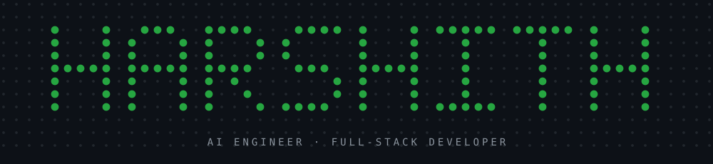
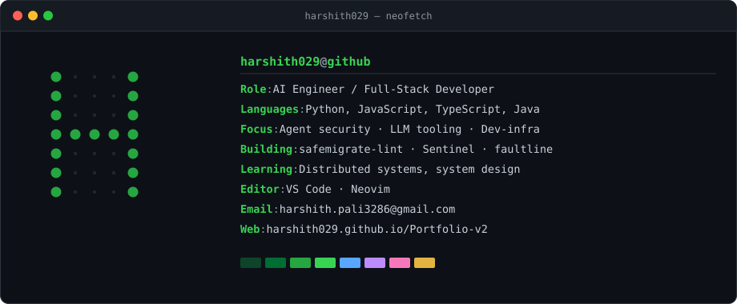

<!--
  Profile README for github.com/Harshith029
  SVG assets are generated — edit scripts/gen_assets.py and re-run:
      python scripts/gen_assets.py
  Stats / languages / contribution calendar are built by GitHub Actions
  (.github/workflows/metrics.yml) and committed into assets/.
-->

 

## `$ whoami`

## `$ ls ~/stack`

**Languages**

**Frontend & Frameworks**

**Backend & Data**

**AI / ML**

 

**Tools & Deployment**

 

## `$ git log --stat`

## `$ ls ~/projects`

<table>
<tr>
<td width="50%" valign="top">

### [safemigrate-lint](https://github.com/Harshith029/safemigrate-lint)

Lints Postgres migrations for the operations that lock tables and take
production down with them.

 

</td>
<td width="50%" valign="top">

### [Sentinel](https://github.com/Harshith029/Sentinel)

A provenance-aware security proxy for AI agents — tracks where each
instruction actually came from before the agent acts on it.

 

</td>
</tr>
<tr>
<td width="50%" valign="top">

### [faultline](https://github.com/Harshith029/faultline)

Self-hosted agent that ranks services by multi-signal telemetry drift,
so the shaky one surfaces before it pages you.

 

</td>
<td width="50%" valign="top">

### [KARMA](https://github.com/Harshith029/KARMA)

Probabilistic entity resolution for government databases — deciding
when two records are the same person without a shared key.

 

</td>
</tr>
</table>

<b><code>$ ls ~/projects --all</code></b>

 

| Project | What it does | Stack |
|:---|:---|:---|
| **[prompt-debugger](https://github.com/Harshith029/prompt-debugger)** | Local-first toolkit for when legitimate prompts trip safeguards | `Python` `LLM` |
| **[Portfolio-v2](https://github.com/Harshith029/Portfolio-v2)** | Personal site — [live](https://harshith029.github.io/Portfolio-v2/) | `HTML` `JS` |
| **[india-runs-track1](https://github.com/Harshith029/india-runs-track1)** | Deterministic candidate discovery and ranking — [live](https://india-runs-track1-aaqd86g8ktcxvgtvvdevop.streamlit.app/) | `Python` `Streamlit` |
| **[nemotron-reasoning-solvers](https://github.com/Harshith029/nemotron-reasoning-solvers)** | Offline pipeline for the NVIDIA Nemotron Reasoning Challenge | `Python` `LLM` |
| **[safemigrate](https://github.com/Harshith029/safemigrate)** | Safety-critical database migration environment for AI agents | `Python` |
| **[UGV-Pathfinding-AI](https://github.com/Harshith029/UGV-Pathfinding-AI)** | Dijkstra + A\* for autonomous vehicle navigation | `Python` |
| **[CSP](https://github.com/Harshith029/CSP)** | Classic Constraint Satisfaction Problem solvers | `Python` |
| **[uninformed-search](https://github.com/Harshith029/uninformed-search)** | Modular BFS / DFS / UCS implementations | `Python` |
| **[aqi-reflex-agent](https://github.com/Harshith029/aqi-reflex-agent)** | Reflex agent computing Air Quality Index from sensor data | `Python` |
| **[paging-adventure](https://github.com/Harshith029/paging-adventure)** | Gamified OS memory-management simulator | `JavaScript` |
| **[Chess-game](https://github.com/Harshith029/Chess-game)** | 2D chess built on HTML5 Canvas | `JavaScript` |

## `$ git log --graph`

 

the snake eats the same grid — regenerated every 12h by Actions

## `$ cat contact.txt`

<!-- LeetCode: add your real handle and uncomment

-->

 

Open to internships and full-time roles in AI / backend / platform. 
Happy to talk about agent guardrails, Postgres, or why your migration locked the table.

## `$ sudo support`

<!-- Sign up with these handles, then uncomment:

-->

 

or just ⭐ a repo — costs nothing, helps plenty

## `$ ls ~/badges`

<table>
  <tr>
    <td align="center">
       
      <a href="https://badges.layer5.io">Get your own badge</a>
    </td>
    <td align="center">
       
      <a href="https://badges.layer5.io">Get your own badge</a>
    </td>
  </tr>
</table>

<code>harshith029@github:~$</code> thanks for scrolling this far.

